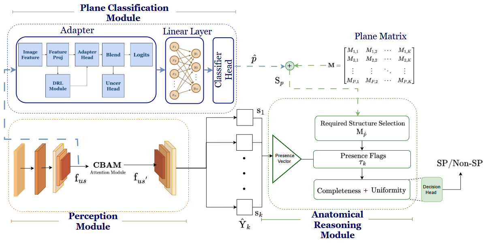

# SAVer: Structure-Aware Validation of Standard Fetal Head Planes

<p align="center">
  
</p>

<p align="center">
  
  
  
</p>

> **SAVer: Structure-Aware Validation of Standard Fetal Head Planes via Clinically Grounded Anatomical Completeness**
> Anusha A, Vasanth Ambrose, Padmini Ramesh, Shyam Ayyasamy, Keerthi Ram, Suresh Seshadri, Manojkumar Lakshmanan, Mohanasankar Sivaprakasam
> IIT Madras · Healthcare Technology Innovation Centre (HTIC) · Mediscan Systems

---

## Overview

Fetal neurosonography requires precise acquisition of three standard head planes — **Transventricular (TV)**, **Transthalamic (TT)**, and **Transcerebellar (TC)** — for reliable biometric measurements and early detection of neurodevelopmental anomalies. In practice, ensuring a captured plane truly meets clinical diagnostic standards is tedious and operator-dependent.

**SAVer** is a structure-aware deep learning framework that goes beyond conventional image-level classification. Instead of relying on learned visual correlations alone, SAVer explicitly verifies the *presence, completeness, and spatial arrangement* of clinically mandated anatomical structures — mirroring the logic an expert sonographer would apply.

### The Core Idea

| Conventional Approach | SAVer |
|---|---|
| Classifies planes from global image embeddings | Classifies planes **and** segments 32 inner brain structures |
| "Black-box" features in latent space | Explicit anatomical presence scores per structure |
| No alignment with clinical diagnostic criteria | Plane-structure dependency matrix grounded in ISUOG guidelines |
| Binary output only | Structured confidence score with anatomical quality breakdown |

---

## Dataset

The dataset was curated retrospectively from a tertiary clinical center:

| Plane | Images |
|-------|--------|
| Transcerebellar (TC) | 400 |
| Transthalamic (TT) | 325 |
| Transventricular (TV) | 370 |
| **Total** | **1,095** |

Each image was annotated by **two clinical experts** and verified by **two independent reviewers**, covering **32 unique anatomical structures** across all three planes.

> **Note:** The dataset is proprietary and was acquired in collaboration with Mediscan Systems, Chennai. It is not publicly distributed. For dataset-related queries, please contact the authors.

---

## Repository Structure

```
SAVer/
├── config.py                      # Training and model hyperparameters
├── dataset.py                     # Data loading and augmentation
├── model_with_classifier.py       # Full SAVer model (backbone + AFAM + classification head)
├── plane_aware_anatomical_loss.py # Plane-aware anatomy loss implementation
├── train_all_structures.py        # Training script (multi-structure segmentation + classification)
├── inference.py                   # Inference and structured confidence score computation
└── method1.png                    # Architecture figure
```

---

## Getting Started

### Prerequisites

```bash
pip install torch torchvision
pip install monai
pip install segment-anything   # MedSAM dependency
pip install timm opencv-python scikit-learn
```

### Installation

```bash
git clone https://github.com/Anushaww26/SAVer.git
cd SAVer
```

Download the MedSAM pretrained weights from the [MedSAM repository](https://github.com/bowang-lab/MedSAM) and place them in the project root.

### Training

```bash
python train_all_structures.py
```

Key configuration options are in `config.py`:

```python
LEARNING_RATE  = 1e-4
NUM_EPOCHS     = 60        # Encoder frozen for first 30 epochs
NUM_STRUCTURES = 32
PLANES         = ['TC', 'TT', 'TV']
```

### Inference

```bash
python inference.py --image_path /path/to/image.png --checkpoint /path/to/checkpoint.pth
```

The inference script outputs:
- Predicted plane label
- Segmentation masks for all required structures
- Structured confidence score `C_std` and a SP / Non-SP decision

---

## Training Details

- **Backbone:** MedSAM ViT-B (fine-tuned)
- **Optimizer:** AdamW with initial LR = 1e-4
- **Epochs:** 60 (encoder frozen for first 30, then jointly fine-tuned)
- **Hardware:** NVIDIA RTX 4090
- **Inference speed:** ~0.44 s per image
- **Loss:** Combined segmentation loss (Dice + Focal + Soft HD + L2) + classification loss (CCE) + plane-aware anatomical loss

---

## Clinical Motivation

Standard plane identification in fetal neurosonography is governed by ISUOG practice guidelines. A valid plane is not just "visually similar" to a reference — it must contain specific anatomical landmarks in correct proportions and spatial relationships. For example:

- **TV plane** requires visualization of the lateral ventricles, choroid plexus, and cavum septi pellucidi
- **TC plane** requires simultaneous visibility of the cerebellum and CSP
- **TT plane** requires the thalami and CSP

SAVer encodes these requirements as a clinician-curated **plane–structure dependency matrix** and uses it to compute anatomical evidence scores at inference time, making the model's decisions traceable and clinically meaningful.

---

## Citation

If you find SAVer useful in your research, please cite:

```bibtex
@inproceedings{anusha2025saver,
  title     = {SAVer: Structure-Aware Validation of Standard Fetal Head Planes via Clinically Grounded Anatomical Completeness},
  author    = {Anusha A and Vasanth Ambrose and Padmini Ramesh and Shyam Ayyasamy and Keerthi Ram and Suresh Seshadri and Manojkumar Lakshmanan and Mohanasankar Sivaprakasam},
  booktitle = {Medical Image Computing and Computer Assisted Intervention (MICCAI)},
  year      = {2026}
}
```

---

## Acknowledgements

This work was carried out at the **Department of Electrical Engineering, IIT Madras** and **Healthcare Technology Innovation Centre (HTIC), IITM**, in clinical collaboration with **Mediscan Systems, Chennai**.

We thank the clinical annotators and reviewers who contributed to the dataset curation, and acknowledge the MedSAM and Segment Anything Model teams for their foundational work.

---

## Contact

For questions or collaborations, reach out to:
- **Anusha A** — anusha@htic.iitm.ac.in
- **Mohanasankar Sivaprakasam** — mohan@ee.iitm.ac.in
